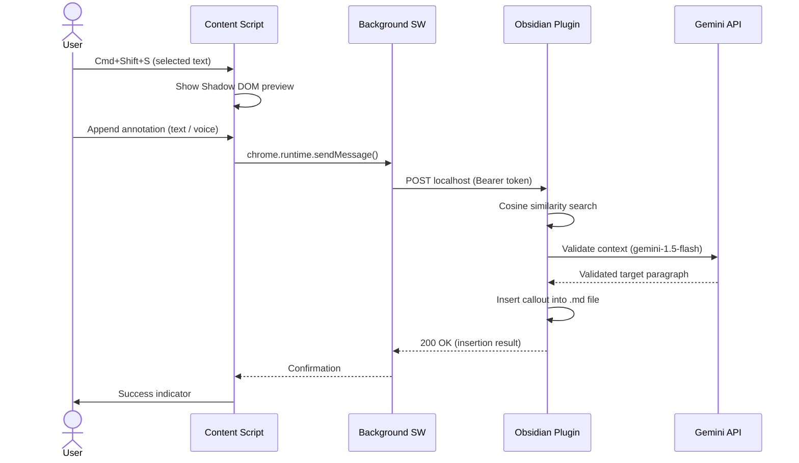

# KnowledgeFlow: Project Constitution

## 1. Project Overview

KnowledgeFlow is a local-first web clipper that inserts semantic text snippets directly into specific paragraphs of a local Obsidian vault. It eliminates context switching by running the UI directly in the browser and routing data via a local HTTP bridge.

---

## 2. Tech Stack & Boundaries

| Layer              | Technology                                                        |
| ------------------ | ----------------------------------------------------------------- |
| Chrome Extension   | Manifest V3, TypeScript, strictly **Shadow DOM** for the UI to prevent CSS bleeding. The UI must include support for the **Web Speech API** to capture voice annotations. |
| Obsidian Plugin    | Node.js, Electron, TypeScript.                                    |
| Data Privacy       | 100% Local-first. Direct localhost communication between Chrome and Obsidian using a **Bearer token**. No third-party cloud accounts. |

---

## 3. The AI Pipeline (4-API Call Limit)

- Use **`text-embedding-004`** exclusively for vault indexing and vector creation.
- Use **`gemini-1.5-flash`** exclusively for semantic context validation and routing. The prompt must ingest both the raw web clipping **AND** the user's contextual annotation to determine the precise target file and paragraph.
- The pipeline must support an **array-batched semantic drill-down** (Sub-10ms search) and format the final insertion as an **Obsidian quote callout**.

> [!IMPORTANT]
> The total number of API calls per clip operation must never exceed **4**. This is a hard architectural constraint.

---

## 4. The Primary User Flow

```
1. TRIGGER           →  User highlights text and presses Cmd+Shift+S.
2. PREVIEW & ANNOTATE→  Inline Shadow DOM popup shows the text preview.
                        The UI provides a text area and a microphone
                        toggle (via Web Speech API or native macOS
                        dictation) for the user to append intent
                        (e.g., "Add this to the related work section
                        for the Germany vs. US comparison").
3. ROUTING           →  Local HTTP bridge sends the text payload AND
                        the annotation to Obsidian. Plugin performs
                        local cosine search + LLM validation using
                        the combined context.
4. INSERT            →  Clip is inserted into the correct contextual
                        paragraph within the local markdown file,
                        including the user's brief note.
```

### Sequence Diagram



---

## 5. Out of Scope for V1

The following features are explicitly **out of scope** and must not be planned or built in the first version:

- Canvas or infinite whiteboard integrations.
- Image or PDF clipping.
- Mobile support or cross-vault synchronization.
- Complex audio-file routing (Voice must be transcribed to text in the browser before sending).

---

## 6. Workspace Structure

```
KnowledgeFlow/                     # ← repo root = workspace root
├── packages/
│   ├── shared/                    # @knowledgeflow/shared — Shared TypeScript types
│   │   ├── src/
│   │   │   ├── index.ts           # Barrel export
│   │   │   └── types.ts           # ClipRequest, ClipResponse, ClipLogEntry, etc.
│   │   ├── package.json
│   │   └── tsconfig.json
│   ├── chrome-extension/          # @knowledgeflow/chrome-extension — Manifest V3
│   │   ├── src/
│   │   │   ├── background.ts      # Service worker: lifecycle, shortcuts, bridge comms
│   │   │   ├── content.ts         # Content script: selection capture, Shadow DOM
│   │   │   ├── popup.ts           # Action popup: clip history, Obsidian Offline state
│   │   │   ├── options.ts         # Options page: port, token, Test Connection
│   │   │   └── ui/
│   │   │       ├── preview.ts     # Shadow DOM preview popup component
│   │   │       └── style.css      # Scoped styles (Shadow DOM isolated)
│   │   ├── dist/                  # Compiled output (git-ignored)
│   │   ├── popup.html             # Action popup shell
│   │   ├── options.html           # Options page shell
│   │   ├── manifest.json          # Chrome Extension Manifest V3
│   │   ├── esbuild.config.mjs     # Multi-entrypoint bundler config
│   │   ├── package.json
│   │   └── tsconfig.json
│   └── obsidian-plugin/           # @knowledgeflow/obsidian-plugin — desktop only
│       ├── src/
│       │   ├── main.ts            # Plugin entry: HTTP server, token lifecycle
│       │   ├── vector-sync.ts     # Vector indexing & cosine search engine
│       │   └── gemini-api.ts      # Gemini API client (flash + embedding)
│       ├── dist/                  # Compiled output (git-ignored)
│       ├── esbuild.config.mjs     # Bundler config → dist/main.js
│       ├── manifest.json          # Obsidian plugin manifest
│       ├── package.json
│       └── tsconfig.json
├── test-vault/                    # Local Obsidian vault for development testing (git-ignored)
│   └── .obsidian/
├── package.json                   # npm workspaces root
├── tsconfig.json                  # Root TypeScript config with path aliases
├── deploy-plugin.ps1              # Quick deploy script: build → copy to test-vault
├── prd.md                         # Product Requirements Document
└── WORKSPACE_README.md            # ← This file (Project Constitution)
```

---

## 7. Development Scripts

Run all commands from the **repo root** (`KnowledgeFlow/`).

```bash
# Install all dependencies across all packages
npm install

# Build all packages
npm run build

# Build a specific package
npm run build:extension
npm run build:plugin

# Watch mode (rebuilds on file change)
npm run dev:extension
npm run dev:plugin

# Run all tests
npm run test

# Run tests for a specific package
npm run test:extension
npm run test:plugin
```

---

## 8. Shared Types

All type contracts between the extension and plugin are in **`packages/shared/src/types.ts`** and imported as:

```typescript
import type { ClipRequest, ClipLogEntry } from '@knowledgeflow/shared';
```

Never duplicate types between packages. The shared package is the single source of truth.
